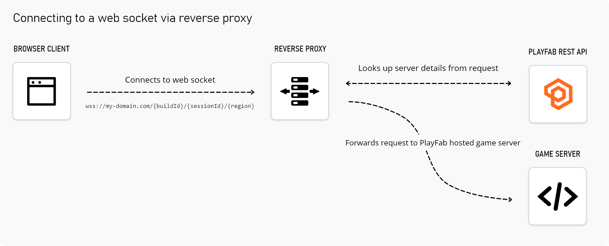

This repository contains sample code for building a reverse proxy that enables secure websocket connections to PlayFab hosted multiplayer servers. This repository is not an official solution, but a starting point for developers who are looking to deploy their game to a browser via websockets.

## The problem
Developers who choose to support WebSocket connections to their game server face a problem when these connections originate from a `https://` domain. PlayFab hosted game servers are typically accessible from a subdomain of `azure.com`. For security reasons, PlayFab cannot issue SSL certificates to developers to use for their `azure.com` hosted game server.

Browser security policies require that WebSocket connections originating from `https://` are created with a secure connection (_WebSocket over https_ or `wss://`).

## A solution
A reverse proxy can be used to forward requests from a `https://` domain to a PlayFab hosted game server, without the need for an SSL certificate on the game server.

**Consider the following browser client flow**
1. The client retrieves the build ID, session ID, and region for an active server. This is typically taken from the result of a call to [Request Multiplayer Server](https://docs.microsoft.com/en-us/rest/api/playfab/multiplayer/multiplayer-server/request-multiplayer-server?view=playfab-rest).
1. Your game's browser client initiates a connection with the server details
    - If owned the top level domain `my-domain.com` the request would be `wss://my-domain.com/{buildId}/{sessionId}/{region}`
2. The reverse proxy looks up the server details and forwards the request to the server's fully qualified domain name.

### Servers allocated by Matchmaking
The previous flow could be modified to use the [Matchmaking API](https://docs.microsoft.com/en-us/rest/api/playfab/matchmaking/matchmaking-service/matchmaking-service). build ID, session ID, and region would be replaced with the the match ID and queue name returned from [Create Matchmaking Ticket](https://docs.microsoft.com/en-us/rest/api/playfab/multiplayer/matchmaking/create-matchmaking-ticket?view=playfab-rest).

## Need help?
While this is not an official solution, the best channel to discuss this respository or receive help is to [open an issue](https://github.com/PlayFab/MultiplayerServerSecureWebsocket/issues/new/choose).
